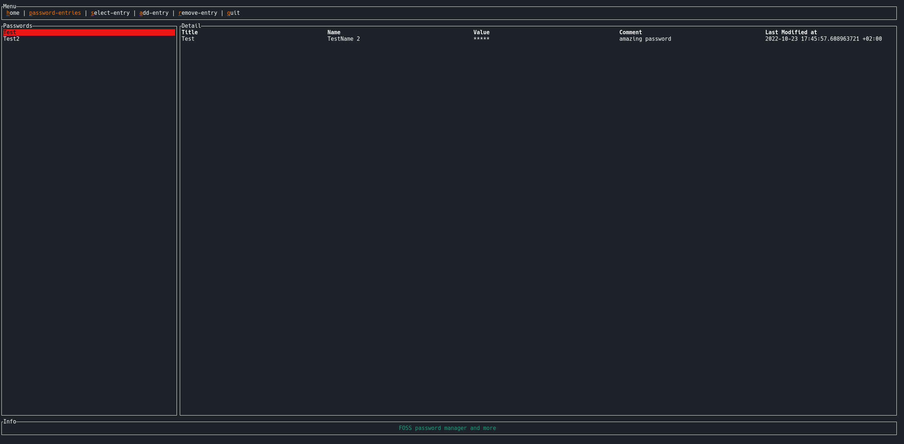

# Vault
Terminal Password-Manager

Simple terminal password manager with strong encryption by using the XChaCha20Poly1305 algortihm.




# Create vault
```
cargo run new -d <path/new_db>
```
follow the commands and a new file will be created in the given directory with given name

# Open your vault:
```
cargo run open -d <path/file_name>
```
or 
```
cargo run open --database-name <path/file_name>
```

# Todos
- improve UI/UX
- code improvments
    - better error handling
- support to save files
- testing
- implement command to import passwords from keepass
- support of environment variables to set them in the terminal 